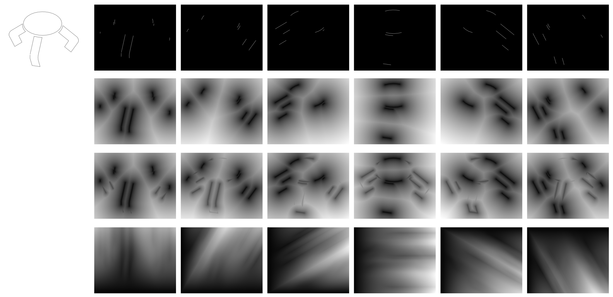
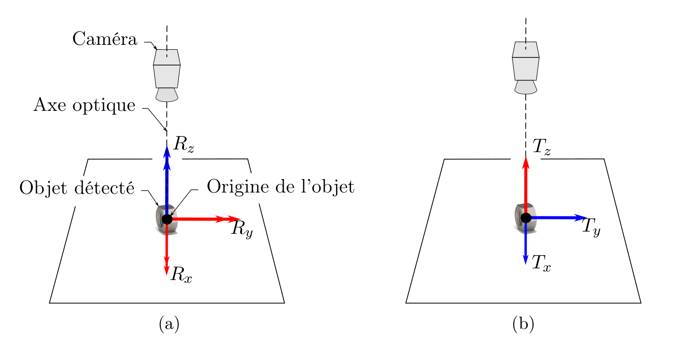
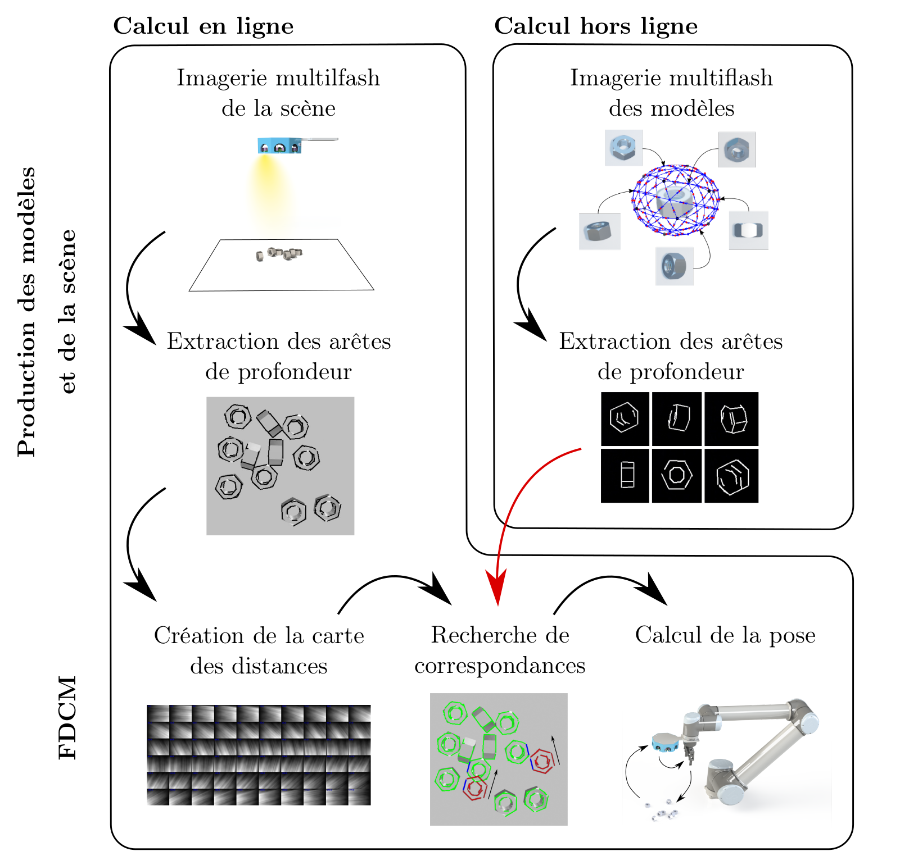

# OpenFDCM

[](http://commitizen.github.io/cz-cli/)
[](https://conventionalcommits.org)
[](LICENSE)  
[](https://badge.fury.io/py/openfdcm)
[](https://github.com/Innoptech/OpenFDCM/actions/workflows/publish-to-test-pypi.yml)
[](https://pypi.org/project/openfdcm/)

**A high-performance C++ library for Fast Directional Chamfer Matching, optimized for template matching on untextured objects.**

OpenFDCM is a fast, lightweight implementation of the Fast Directional Chamfer Matching (FDCM) algorithm, built for precise template matching in low-texture scenes. It balances speed and accuracy for real-world computer vision tasks, using only classical computer vision techniques — no AI involved. This ensures a deterministic, repeatable method that adapts quickly to new, unseen objects, making it ideal for manufacturing industries where reliability, ease of diagnosis, and seamless integration are crucial. The library is highly extensible, utilizing modern C++ type erasure techniques to provide flexibility and maintainability.




### Beta Milestone Progress:
- ✅ **Removed OpenCV dependency**
- ✅ **Python bindings available**
- ✅ **Usage examples provided**
- ⬜ **GPU support via OpenGL ES or OpenCL for multiple vendor compatibility**
- ⬜ **Build Python wheels for Windows in ci**

---

## Python Usage

### Installation
Get OpenFDCM via PyPI:
```bash
pip install openfdcm
```

Alternatively, install directly from the GitHub repository for the latest updates:
```bash
pip install -U git+https://github.com/Innoptech/OpenFDCM@main
```


### Template matching example
For complete examples in python, see the [jupyter notebooks](notebooks).

```python
import openfdcm

templates = # A list of 4xN array where each array is a template represented as N lines [x1, y1, x2, y2]^T
scene = # A 4xM array representing the M scene lines

# Perform template matching
max_tmpl_lines, max_scene_lines = 4, 4  # Combinatory search parameters.
depth = 30              # The [0, pi] discretization.
scene_padding = 1.5     # A ratio to pad the scene images used in the FDCM algorithm, use if best match may appear on image boundaries.
coeff = 5.0             # A weighting factor to enhance the angular cost vs distance cost in FDCM algorithm.
#num_threads = 4

threadpool = openfdcm.ThreadPool() # could pass num_threads here, but default is optimal
featuremap_params = openfdcm.Dt3CpuParameters(depth, coeff, scene_padding)
search_strategy = openfdcm.DefaultSearch(max_tmpl_lines, max_scene_lines)
optimizer_strategy = openfdcm.BatchOptimize(10, threadpool)
matcher = openfdcm.DefaultMatch()
penalizer = openfdcm.ExponentialPenalty(tau=1.5)

# Build FDCm feature map and search
start_time = time.time()
featuremap = openfdcm.build_cpu_featuremap(scene, featuremap_params, threadpool)
raw_matches = openfdcm.search(matcher, search_strategy, optimizer_strategy, featuremap, templates, scene)
penalized_matches = openfdcm.penalize(penalizer, raw_matches, openfdcm.get_template_lengths(templates))
sorted_matches = openfdcm.sort_matches(penalized_matches)
search_time = time.time() - start_time

print(f"Template matching search completed in {search_time:.4f} seconds.")

best_match = sorted_matches[0]                 # Best match (lower score) is first
best_match_id = best_match.tmpl_idx
best_matched_tmpl = templates[best_match_id]
result_rotation = best_match.transform[0:2, 0:2]
result_translation = best_match.transform[0:2, 2]
```

## 6-DOF estimation
The illustration of the six degrees of freedom of a detected object. The blue arrows represent the degrees of freedom in the image plane. The set of blue and red arrows represents the degrees of freedom in space. In a), the rotation axes in SO(3) are illustrated, and in b), the translation axes in T(3).



Template matching on a single view provides 5 Degrees of Freedom (DOF) per detection, with the final missing DOF for full 6-DOF estimation requiring at least two views of the same scene, combined with calibrated extrinsic parameters.

However, in the absence of a multiview camera, it is possible to estimate the 6th DOF if the following hypothesis is assumed: `The objects all touch a plane in at least one point and the plane pose is known`.

Procedure (about 5 - 30ms per scene): 
1. We sample templates of our object using a OpenGL renderer in a 2-DOF space (2 rotation). In the case of low-texture + specular reflections object, a multiflash renderer + depth edge detector is needed (might come in a future open-source library).
2. We perform the scene imagery using a multiview camera (or a single view for 5-DOF + plane hypothesis).
3. We perform template matching using `openfdcm` on each view.
4. We triangulate and filter out the match candidates using a voting-scheme algorithm from the multiview detections (will come in a future Open-Source library).
5. From the filtered matches, we combine the corresponding template information, the triangulated position and the image in-plane rotation (rotation in z) to retreive full 6-DOF pose.




## C++ usage
Require C++20 or higher.

### Integrate to your codebase
Include this repository with CMAKE Fetchcontent and link your executable/library to `openfdcm::matching library`.   
Choose weither you want to fetch a specific branch or tag using `GIT_TAG`. Use the `main` branch to keep updated with the latest improvements.
```cmake
include(FetchContent)
FetchContent_Declare(
    openfdcm
    GIT_REPOSITORY https://github.com/Innoptech/OpenFDCM.git
    GIT_TAG main
    GIT_SHALLOW TRUE
    GIT_PROGRESS TRUE
)
FetchContent_MakeAvailable(openfdcm)
```

### Test
```bash
git clone https://github.com/Innoptech/OpenFDCM
mkdir OpenFDCM/build && cd OpenFDCM/build
cmake -DOPENFDCM_BUILD_TESTS=ON .. && cmake --build .
ctest .
```

## Contributions & Feedback
We welcome contributions! Please submit pull requests or report issues directly through the [GitHub repository](https://github.com/Innoptech/OpenFDCM).

## Citing OpenFDCM
If you use OpenFDCM in your research, please use the following BibTeX entry.
```bibtex
%Bibtex to come
```