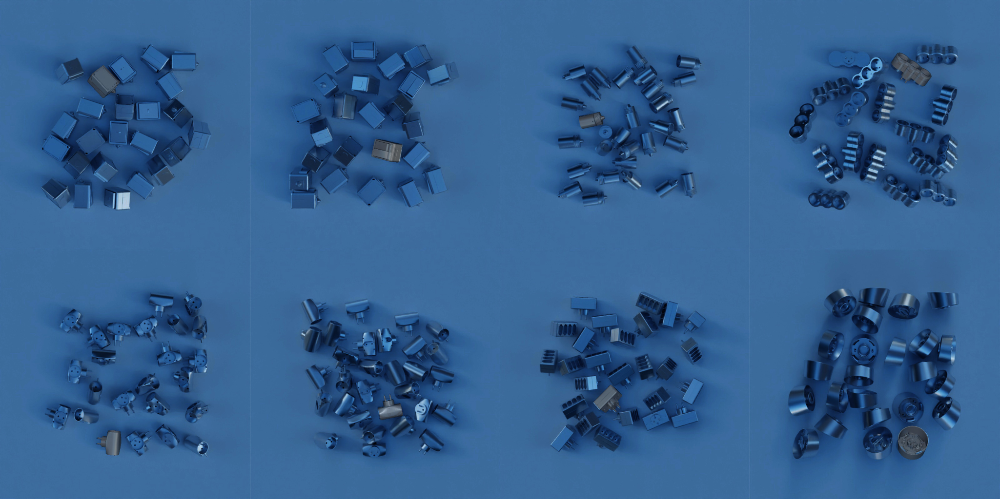

# OpenFDCM
A modern C++ open implementation of Fast Directional Chamfer Matching with few improvements.


[](http://commitizen.github.io/cz-cli/)
[](https://conventionalcommits.org)
[](LICENSE)  
[](https://badge.fury.io/py/openfdcm)
[](https://github.com/Innoptech/OpenFDCM/actions/workflows/publish-to-test-pypi.yml)
[](https://pypi.org/project/openfdcm/)  
**Beta Milestone:**
- [x] Removal of OpenCV dependency
- [x] Python Binding
- [x] Usage Examples
- [ ] GPU support using GL ES shaders for full vendors support

# Python usage

```python
templates = # A list of 4xN array where each array is a template represented as N lines [x1, y1, x2, y2]^T
scene = # A 4xM array representing the M scene lines

# Perform template matching
max_tmpl_lines, max_scene_lines = 4, 4  # Combinatory search parameters.
depth = 30              # The [0, pi] discretization.
scene_ratio = 1.0       # The image size ratio used for FDCM algorithm. Reduce size for faster but less precise search.
scene_padding = 1.0     # Pad the scene images used in the FDCM algorithm, use if best match may appear on image boundaries.
coeff = 5.0             # A weighting factor to enhance the angular cost vs distance cost in FDCM algorithm.

search_strategy = DefaultSearch(max_tmpl_lines, max_scene_lines)
optimizer_strategy = DefaultOptimize()
matcher = DefaultMatch(depth, coeff, scene_ratio, scene_padding)

matches = search(matcher, search_strategy, optimizer_strategy, templates, scene)

best_match = matches[0]                 # Best match (lower score) is first
best_match_id = best_match.tmpl_idx
best_matched_tmpl = templates[best_match_id]
result_rotation = best_match.transform[0:2, 0:2]
result_translation = best_match.transform[0:2, 2]
```

For a complete example in python, see [templatematching.py](examples/templatematching.py).

# Integrate to your codebase
### Smart method
Include this repository with CMAKE Fetchcontent and link your executable/library to `openfdcm::matching library`.   
Choose weither you want to fetch a specific branch or tag using `GIT_TAG`. Use the `main` branch to keep updated with the latest improvements.
```cmake
include(FetchContent)
FetchContent_Declare(
    openstl
    GIT_REPOSITORY https://github.com/Innoptech/OpenFDCM.git
    GIT_TAG main
    GIT_SHALLOW TRUE
    GIT_PROGRESS TRUE
)
FetchContent_MakeAvailable(openfdcm)
```

# Test
```bash
git clone https://github.com/Innoptech/OpenFDCM
mkdir OpenFDCM/build && cd OpenFDCM/build
cmake -DOPENFDCM_BUILD_TESTS=ON .. && cmake --build .
ctest .
```

# Requirements
C++20 or higher.

# Perform object pose estimation

